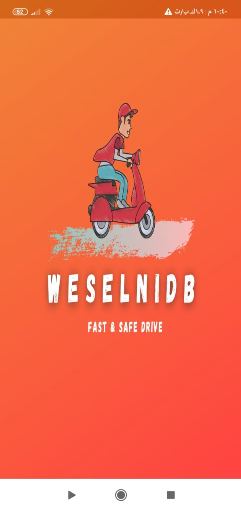
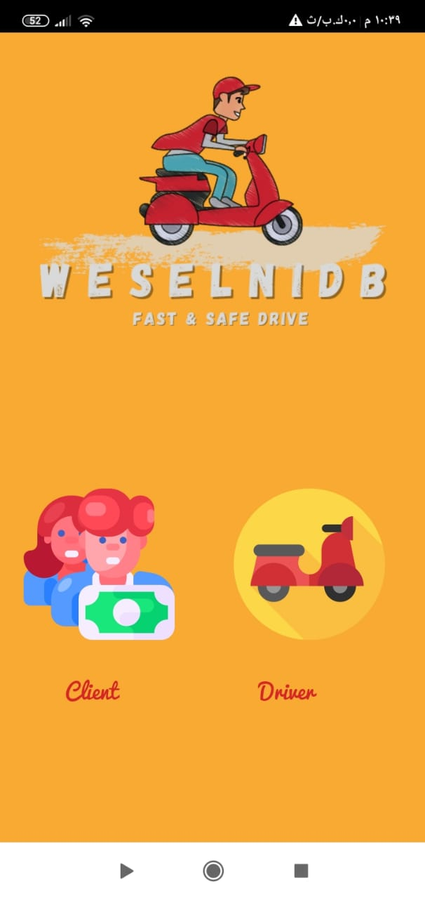
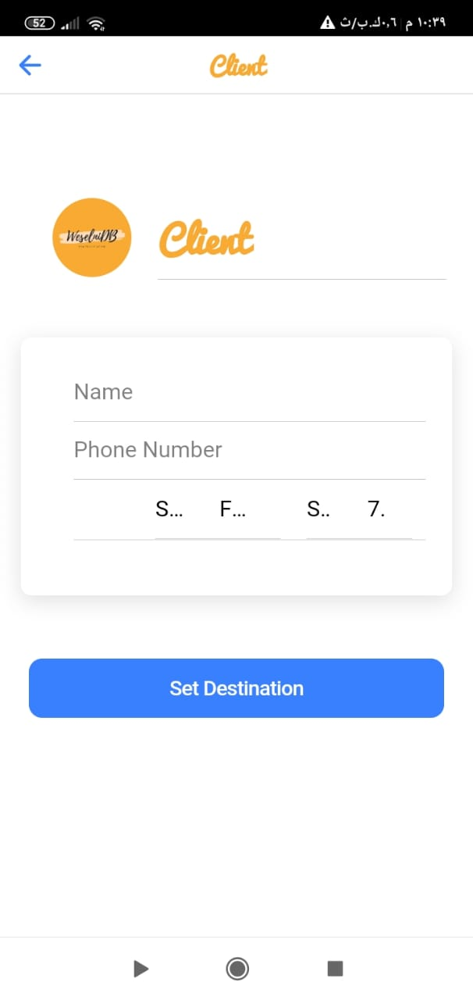
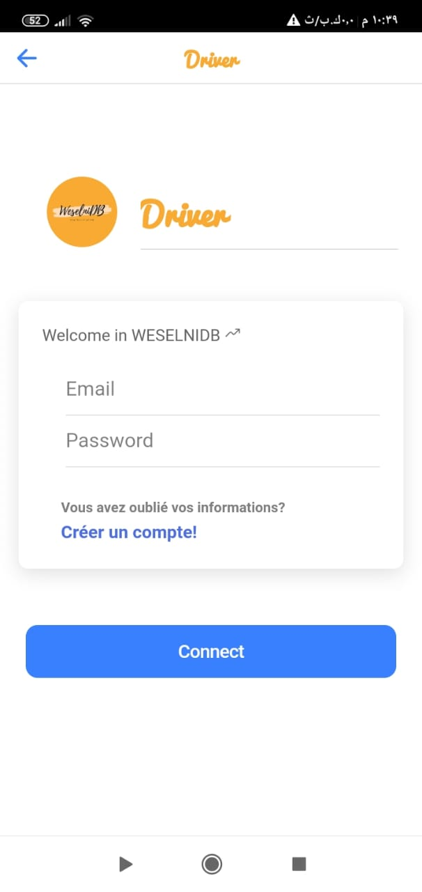
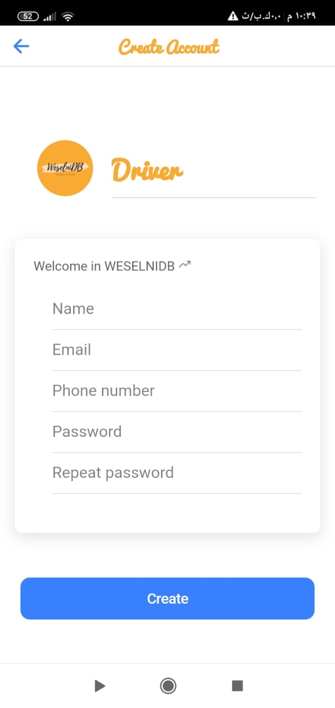

# WeselniDB Mobile Application

### What is this repository for? ###

* This is a mobile application provide a taxi service with bikes, the aims is to save time, money and energy.
* Spring boot for the Backend and Ionic For the mobile side

### How do I get set up? ###

* Clone your project 
```sh
$ git clone https://github.com/Vvoox/WeselniDB_Application.git
$ cd WeselniDB_Application
$ ./mvnw
```

### Technologies used ? ###

* Spring Boot for the Backend.
* Ionic for mobile .
* PostgreSQL for the DataBase.


### Realization ###

## main Home 1 ##



## main Home 2 ##



## Client side : Ask for ride ##



## Client Location ##


## Driver side : Authentication ##


Bonjour,
 
Je me permets de vous écrire pour vous informer de ma démission de mon poste de Développeur Full Stack, avec une date de départ effective le 02/03/2024, 
conformément au préavis convenu d’une durée de 1 mois.
 
Je tiens d’abord à vous remercier pour les opportunités de croissance et de développement professionnels qui m’ont été offerts durant ma mission au sein de la SGMA.
 
Toutefois, il m’est crucial de souligner les raisons ayant motivé ce départ, notamment :
 
Un environnement où les responsabilités ne sont pas systématiquement alignées sur les rôles, ce qui a entrainé d’ailleurs le départ de deux collègues au niveau de la Tribe (PP – PM), 
mais étaient sous une pression du management uniquement pour leurs choix de ne pas assumer les responsabilités du Tech Lead, 
qui sont bien évidemment au-delà des tâches obligatoires qui les incombent en leurs qualités de développeur.
 
Une atmosphère que je ne peux que qualifier de toxique, constatée à plusieurs reprises, et à l’encontre de plusieurs ressources, 
et la pression quotidienne injustifiée remettant en cause notre qualité de travail et notre productivité par TAL,
 
L’ingratitude et le dénigrement. Parce que oui, bien qu’on soit prestataires, nous demeurons tout de même des êtres humains ! 
Je ne vais pas m’attarder sur toutes les réalisations que nous avons pu accomplir en de très brefs délais, 
puisque notre devise à tous a été de faire le meilleur et le maximum, et ce dans le cadre des rôles prédéfinis de tout un chacun …
 
Enfin, je vous réitère ma gratitude pour le temps passé et les défis relevés tout au long de mon passage, et vous souhaite bonne chance pour la suite.


## Driver side : Sign up ##


